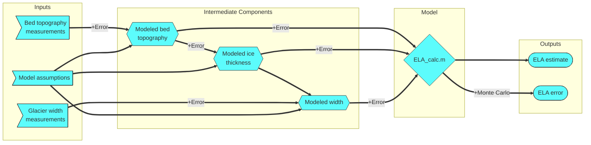
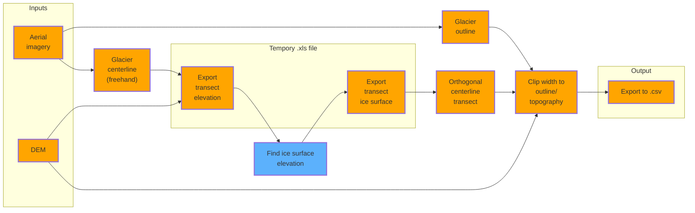

# Mermaid diagrams

A space to keep archival code to generate mermaid diagrams for use in the paper.
Go to the [live editor](https://mermaid-js.github.io/mermaid-live-editor/) in order to generate .png of the charts.

## Graphical abstract



```json
{
  "theme": "forest",
  "flowchart": {
    "htmlLabels": false,
    "useMaxWidth": false,
    "rankSpacing": 15,
    "nodeSpacing": 50
  }
}
```

## ArcGIS workflow



```json
{
  "theme": "forest",
  "flowchart": {
    "htmlLabels": false,
    "useMaxWidth": false,
    "rankSpacing": 15,
    "nodeSpacing": 50
  }
}
```
