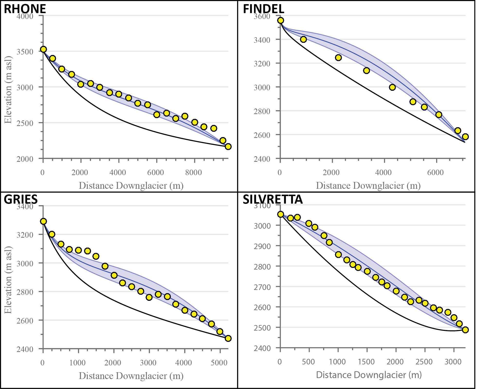
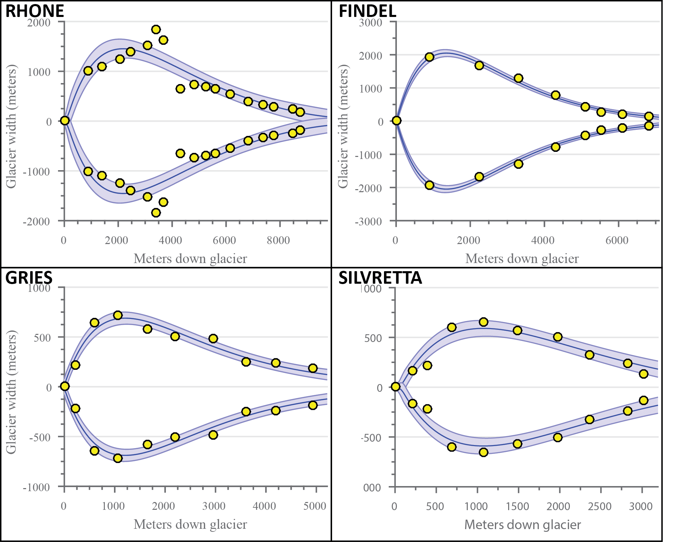

# Title: Name the ELA method explained below

## Abstract

Blah blah blah

## Introduction

All of these methods, although useful in certain circumstances, highlight the need for additional progress to help better constrain ELA estimates in a robust, self-consistent manner, while still requiring minimum inputs.
Such a method, combined with tight age constraints, would allow for more accurate, temporally precise comparisons of shifts in climate across regions.
This in turn would help to elucidate the primary factors involved in such changes.
Here we detail a new ELA model intended specifically to address these concerns, incorporating contributions from the bed topography and areal and hypsometric distribution of a glacier, along with estimates of glacier ice thickness.
This new model is largely derived from a simple linear glacier-length model proposed by Oerlemans (2011), with modifications specific to quantifying ELAs and ELA changes.
We furthermore provide model uncertainty estimates based on standard Monte Carlo simulations, also taking into account uncertainty in model input data.
We provide MATLAB functions and scripts of this model to provide a user-friendly and generally-applicable method to estimate glacier ELAs from easily-measured morphology parameters.
As a test of the model’s accuracy, we compare the model results for present-day glaciers in the Swiss Alps with previously published estimates of the ELAs and intermediate model outputs (e.g. bed topography, ice thickness, etc.).

## Methodology

A balance must be struck between the applicability and ease of use of a model, and the factors and physics a model can readily incorporate.
This research presents a method to reconstruct ELA estimates based largely on physical relationships, while still requiring minimal data input.
This necessarily requires numerous simplifying assumptions, which ignore some details pertinent to individual glaciers.
Such details are significant for some applications (e.g. dynamic modeling of glacier response, higher order surface energy and mass balance modeling, etc.), and other methods would be better suited to these circumstances.
The proposed model is specifically intended for snow-fed, clean ice, temperate glaciers with relatively simple bed and areal geometries, and caution should be used in applications beyond these boundaries.
This ELA model is similar in simplicity to such methods as THAR or AAR methods, but more physically based rather than relying purely on empirical correlations.
It therefore should be more readily and generally applicable without regard for tuning to regional climate conditions.

Physical relationships give direct applicability and robustness to models over statistical methods of similar resolution through better accounting of intrinsic differences between glacier systems.
AAR, THAR, or other similar statistical ELA models often fail to account for differences in glacier bed elevation, ice thickness, profile shape, etc. which have measurable effects on the overall ELA of a glacier.
Furthermore, although all models have certain limits outside of which they are invalid, statistical models rarely include indications of when a particular application lies outside these bounds.
The ELA model presented here, by accounting for differences in physical characteristics, yields diagnostic results useful in determining how well the model captures different aspects of glacier characteristics, therefore providing validation of the applicability to a specific glacier.
These attributes allow for more accurate results and greater applicability with increased confidence.

The ELA model provides analytical constraints on the error associated with model outputs.
Such uncertainties help determine the significance and reliability of results, and are unfortunately not always adequately accounted for in paleoclimate research (Tarasov, 2012).
Uncertainty estimates in this study are calculated based on Monte Carlo simulations of bootstrapped residuals of the input parameters.
These uncertainties give insight into the range of plausible ELA values based on both uncertainty of input parameters and the ability of the model assumptions to accurately represent those inputs.

### Balance equation

The fundamental basis of the ELA model is an integrated balance equation (Equation 1) for steady-state glaciers, adapted from Oerlemanns (2011),

$$
B_n = \int_0^L \dot{b}dx = \beta \int_0^L \left[ w(x) \left( H(x)+z(x)-ELA \right) \right]dx
$$

where $B_n$ is the total net balance, $x$ is the distance down glacier, $\dot{b}$ is the specific balance rate at $x$, $L$ is the glacier length, $\beta$ is the balance gradient, $w(x)$ is the glacier width at $x$, $H(x)$ the ice thickness at $x$, $z(x)$ represents the valley topography, and $ELA$ is the equilibrium line altitude.
In steady state conditions (like we assume for glaciers with well-developed moraine sequences), the total net balance is zero.
The balance gradient $\beta$ can be dropped in this case, and Equation 1 can then be rearranged to solve for the $ELA$ (Equation 2).

$$
ELA = \frac{\int_0^L w(x)H(x)dx + \int_0^L w(x)z(x)dx}{\int_0^L w(x)dx}
$$

We then estimate each of the three components ($H(x)$, $w(x)$, and $z(x)$) along the length of the glacier.
Methods for the estimation of each of these parameters are detailed below.

### Glacier bed modeling

Bed topography measurements follow a representative 1D line along the glacier profile, typically taken down the center of the glacier.
We then estimate $z(x)$ from a best-fit two-term exponential curve of this 1D profile line (Equation 3), where $a$, $b$, $c$, and $d$ are fitting coefficients optimized in the model using the elevation data inputs.

$$
z(x) = ae^{bx} + ce^{dx}
$$

Approximately ten quasi-equally spaced points along the length of the glacier are often sufficient to constrain the exponential curve, though the optimum number depends on the length and complexity of the bed topography.
This two-term exponential estimate is best suited for valleys with relatively simple bed topographies.
Caution should be used when applying this method to glacier beds with more complex bed features, such as steep cliffs or over deepenings, as these are not always readily captured in the model (Figure 1).

### Glacier width modeling

Due to the high diversity in glacier shape/geometry, estimating the plan-view profile of the glacier in a consistent yet simple manner is difficult.
Additionally, accurately constraining the width of the accumulation area for paleoglaciers presents further challenges, due to a lack of preserved moraines or other features delineating glacier boundaries in these areas.
To best cope with these issues, we estimate glacier width using an exponential equation of the same form as Oerlemanns (2011) (Equation 4).
We then use a least squares nonlinear curve fit to optimize the width estimation.
The initial starting parameters are the minimum width of the glacier at the toe ($w0$), maximum glacier width in the accumulation zone ($w_{max}$), the distance down glacier ($x$), and the distance down glacier to the point of maximum width ($L_{Wmax}$).

$$
w(x) = w_0 + \frac{w_{max}-w_0}{L_{Wmax}}xe^{1-\frac{x}{L_{Wmax}}}
$$

This produces an exponential curve, following the general shape of many glaciers.
The model then modifies the three initial parameter estimates to reach an optimal fit with the input width values for a specific glacier (Figure 2).

The model can accept glaciers with tributaries, which are added to the main glacier width by elevation bins.
Increased caution should be exercised with this model as the glacier plan profile departs from the idealized shape.

### Ice thickness modeling

To first order, the thickness of a glacier depends largely on the slope and shear stress at the bed (Cuffey and Paterson, 2010).
The simplest equation to approximate ice thickness is therefore

$$
H = \frac{\tau}{\rho g \sin\theta}
$$

where $H$ is the ice thickness (m), $\tau$ is the basal shear stress (Pa), $\rho$ is the ice density (kg/m3), $g$ is acceleration due to gravity (m/s^2), and $\theta$ is the angle at the bed interface (Cuffey and Patterson, 2010).
In areas with shallow slopes, however, this equation leads to ice thickness unrealistically approaching infinity.
Oerlemans (2011) demonstrates a square root relation between length and ice thickness (assuming perfect plasticity), which we incorporate into our estimates in order to address this issue (Equation 6).

$$
H_m = \frac{2}{3} \sqrt{\frac{\tau L}{\rho g \left( 1+\sin\theta \right)}}
$$

This equation, however, gives the mean ice thickness ($H_m$) for the glacier, rather than discrete values along its length.
To model ice thickness profiles, we assume a parabolic distribution (true of a perfectly plastic glacier on a flat bed) around the mean ice thickness.
Ice density is assumed to be 917 kg/m^3 and the gravitational acceleration is set at 9.8 m/s^2.
The basal shear stress ($\tau$) is assumed to scale with ice thickness, following the relationship presented in Haeberli and Hoelzle (1995), where $\Delta z$ is the difference between the minimum and maximum bed elevation (Equation 7).

$$
\Delta z > 1600 \:m \Longrightarrow \tau = 150 \:kPa \\
500 \:m \le \Delta z \le 1600 \:m \longrightarrow \tau = 0.005 + 1.598\Delta z - 0.435\Delta z^2 \\
\Delta z < 500 \:m \longrightarrow \tau = 3\Delta z
$$

### Monte Carlo simulations

We perform Monte Carlo simulations to capture the distribution of plausible ELAs for a given glacier.
Such estimation of uncertainty is important to adequately compare the significance of results, particularly if attempting to compare results from differing methodologies or between regions. Monte Carlo methods are widely used to characterize the range and distribution in the outputs of models for physical systems (e.g. Tarasov et al., 2012; Colgan et. al., 2012; Kuczera and Parent, 1998).
Such techniques are well suited to provide bounds of uncertainty, particularly within inter-related and multivariable systems with numerous degrees of freedom (Kroese et. al., 2011; Colgan et. al., 2012).
Indeed, several studies investigating glacier mass and energy balances use similar Monte Carlo methods for uncertainty estimation (Mölg et al, 2012; Machguth et al, 2008; Konz and Seibert, 2010).
In our approach, each simulation includes bootstrapping with replacement techniques to assess the uncertainty in model estimation.
Bootstrapping is a resampling scheme often used for significance testing of multivariate data sets (Trauth, 2010).
We use it here to determine how accurately we model our input parameters, and we further include any known errors in those parameters (bed elevation, glacier width, and mean basal shear stress), assuming Gaussian distributions in these error values.
Each model run consists of 1,500 iterations in order to approximate a continuous distribution in plausible ELA values.

## Model validation

Before applying our proposed methodology to paleo-glaciers, we tested the modeled ELAs with independent ELA data.
In particular, we chose 4 glaciers in the Swiss Alps based on their close proximity to our target paleoglaciers.
These glaciers were also selected due to the availability of data requisite for a data-model comparison (including present-day ice thickness, bed topography beneath the present-day glacier, mass balance measurements, aerial photography and DEMs).
The four test glaciers are the Gries Glacier, the Findel Glacier, the Rhone Glacier, and the Silvretta Glacier (Figure 7).
These glaciers were further selected due to differences in overall shape and extent, thereby providing a wide range of possible glacier geometries.
Three of these glaciers (Gries, Silvretta, and Findel) have continuous multi-year mass balance measurements from stake networks compiled by the World Glacier Monitoring Service (WGMS), and therefore make for the most compelling comparisons.
The Rhone Glacier has mass balance measurements from a handful of isolated years, providing a less certain, but still useful comparison to the model and other glaciers.

### Data sources

We obtained width and overall length measurements for the 4 validation glaciers from aerial and satellite imagery.
These data are summarized in Figure 8.
Although exact margins of error for these data were not available, we assume an error of ±30 m, a similar resolution to satellite images from NASA’s LANDSAT 5 database.
ASTER GDEMs, with a prescribed error of ±30 m, provided ice surface elevations, which we use in combination with measurements of bed topography to calculate ice thickness.
Bed elevations are from modeled topographies in Farinotti et. al (2009) and Farinotti (2010), which they constrained using multiple GPR profiles and/or borehole depths for each glacier.

Mass balance and ELA measurements were acquired from the WGMS and a study by Zemp et. al., (2007).
The Silvretta and Gries glaciers have the best-constrained mass balances with ~50 years of published data for each (PSFG, 1967; PSFG, 1973; PSFG, 1977; PSFG, 1985; WGMS, 1988; WGMS, 1993; WGMS 1998; WGMS 2005; WGMS 2008; WGMS 2012).
In order to compare the current climatic ELA of these glaciers with our modeled ELA, we calculate the median mass balance ELA from the linearly detrended annual ELA values from 1960-2010 for both glaciers, with uncertainty calculated to the 95% confidence interval.
The Findel Glacier has similarly well-constrained mass balance measurements from a glacier stake network, but with a much shorter record (2005-2010) which we use to estimate the climatic ELA (WGMS, 2012).
The Rhone Glacier does not have consistent year-to-year mass balance measurements.
Instead, we take modeled steady-state ELA estimates from air temperature correlations (1971-1990) provided in Zemp et. al. (2007).
These ELA estimates are constrained with the few years of available stake mass balances (mean r^2 coefficient between balance ELA and air temperature-correlated ELA is 0.89).
No uncertainty estimates were provided for the Rhone Glacier ELA.
For consistency, we assume Gaussian uncertainties with bounds similar to the average uncertainty of the mass balances for the Silvretta, Gries, and Findel glaciers (±48 m).

### Model output comparisons

