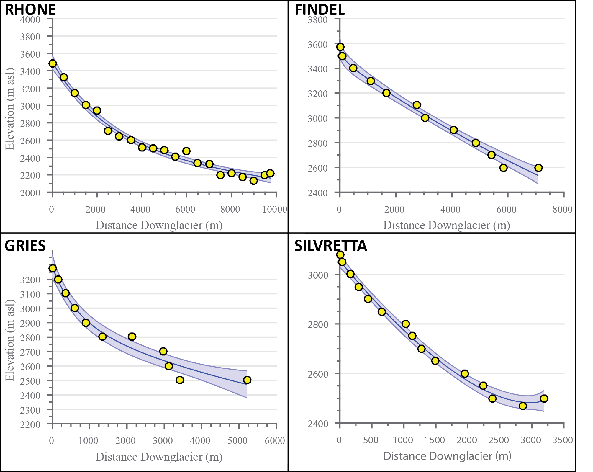
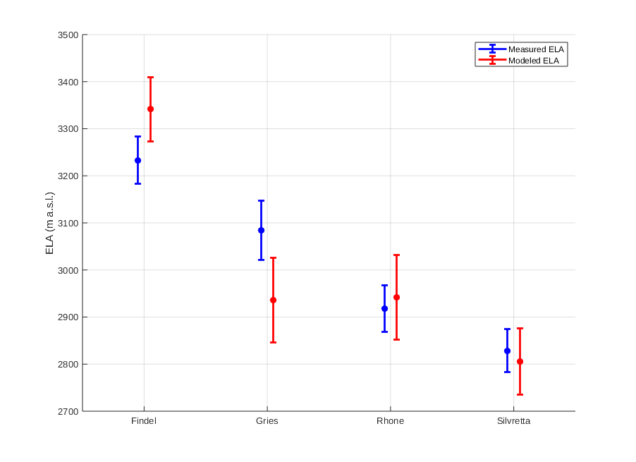

# Title: Name the ELA method explained below

## Abstract

Glaciers are widely used in paleoclimatic reconstructions, with their unique combination of large spatial footprint, direct response to climate, and near-global extent making them indispensable tools.
Although increasing computing power enables highly complex transient glacier modeling, the lack of detailed climatic data in the past typically requires paleoclimate studies to focus on computationally simple methods of reconstruction, frequently based on changes in a glacier’s geomorphic extent.
The equilibrium line altitude (ELA) of a glacier, as a direct measure of annual glacier mass balance, facilitates direct comparisons of climate by avoiding strong dependencies on glacier dynamics and by integrating the myriad variables that can drive changes in climate into a single metric.

Here we detail a new ELA model that retains the simplicity of many other paleo-glacier reconstructions, but further incorporates physically based assumptions that relate this estimate more directly and generally to glacier mass balance than statistical approaches.
The model is largely derived from a simple linear glacier-length model presented in [@oerlemans_minimal_2008], with modifications specific to quantifying ELAs and ELA changes.
We provide MATLAB functions and scripts of this model to provide a user-friendly and generally-applicable method to estimate glacier ELAs from easily-measured morphology parameters.
As a test of the model’s efficacy, we compare the model results for present-day glaciers in the Swiss Alps with previously published estimates of ELAs and intermediate model outputs.

## Graphical abstract

This is where the graphical abstract goes.

## Methodological principles

A balance must be struck between the applicability and ease of use of a model, and the factors and physics a model can readily incorporate.
This research presents a method to reconstruct ELA estimates based largely on physical relationships, while still requiring minimal data input.
This necessarily requires numerous simplifying assumptions, which ignore some details pertinent to individual glaciers.
Such details are significant for some applications (e.g. dynamic modeling of glacier response, higher order surface energy and mass balance modeling, etc.), and other methods would be better suited to these circumstances.
The proposed model is specifically intended for snow-fed, clean ice, temperate glaciers with relatively simple bed and areal geometries, and caution should be used in applications beyond these boundaries.
This ELA model is similar in simplicity to such methods as THAR or AAR methods [@benn_mass_2000], but more physically based rather than relying purely on empirical correlations.
It therefore should be more readily and generally applicable without regard for tuning to regional climate conditions.

The ELA model also provides analytical constraints on the error associated with model outputs.
Such uncertainties help determine the significance and reliability of results, and are unfortunately not always adequately accounted for in paleoclimate research [@tarasov_data-calibrated_2012].
Uncertainty estimates in this study are calculated based on Monte Carlo simulations of bootstrapped residuals of the input parameters.
These uncertainties give insight into the range of plausible ELA values based on both uncertainty of input parameters and the ability of the model assumptions to accurately represent those inputs.

### Balance equation

The fundamental basis of the ELA model is an integrated balance equation (Equation 1) for steady-state glaciers, adapted from @oerlemans_minimal_2008,

$$
B_n = \int_0^L \dot{b}dx = \beta \int_0^L \left[ w(x) \left( H(x)+z(x)-ELA \right) \right]dx
$$

where $B_n$ is the total net balance, $x$ is the distance down glacier, $\dot{b}$ is the specific balance rate at $x$, $L$ is the glacier length, $\beta$ is the balance gradient, $w(x)$ is the glacier width at $x$, $H(x)$ the ice thickness at $x$, $z(x)$ represents the valley topography, and $ELA$ is the equilibrium line altitude.
In steady state conditions (like we assume for glaciers with well-developed moraine sequences), the total net balance is zero.
The balance gradient $\beta$ can be dropped in this case, and Equation 1 can then be rearranged to solve for the $ELA$ (Equation 2).

$$
ELA = \frac{\int_0^L w(x) H(x)dx + \int_0^L w(x) z(x)dx}{\int_0^L w(x) dx}
$$

We then estimate each of the three components ($H(x)$, $w(x)$, and $z(x)$) along the length of the glacier and solve for each component using trapezoidal numerical integration to derive an estimate for $ELA$.
Methods for the estimation of each of these components are detailed below.

### Glacier bed modeling

Bed topography measurements follow a representative 1D line along the glacier profile, typically taken down the center of the glacier.
We then estimate $z(x)$ from a best-fit two-term exponential curve of this 1D profile line (Equation 3), where $a$, $b$, $c$, and $d$ are fitting coefficients optimized in the model using the elevation data inputs.
Optimizations in this ELA model rely on nonlinear least squares regression based on *trust region* algorithms [@more_computing_1983].

$$
z(x) = ae^{bx} + ce^{dx}
$$

This two-term exponential estimate is best suited for valleys with relatively simple bed topographies.
Caution should be used when applying this method to glacier beds with more complex bed features, such as steep cliffs or over deepenings, as these are not always readily captured in the model.

### Ice thickness modeling

To first order, the thickness of a glacier depends largely on the slope and shear stress at the bed [@cuffey_physics_2010].
The simplest equation to approximate ice thickness is therefore

$$
H = \frac{\tau}{\rho g \sin\theta}
$$

where $H$ is the ice thickness (m), $\tau$ is the basal shear stress (Pa), $\rho$ is the ice density (kg/m3), $g$ is acceleration due to gravity (m/s^2), and $\theta$ is the angle at the bed interface [@cuffey_physics_2010].
In areas with shallow slopes, however, this equation leads to ice thickness unrealistically approaching infinity.
Oerlemans (2011) demonstrates a square root relation between length and ice thickness (assuming perfect plasticity), which we incorporate into our estimates in order to address this issue (Equation 5).

$$
H_m = \frac{2}{3} \sqrt{\frac{\tau L}{\rho g \left( 1+\sin\theta \right)}}
$$

This equation, however, gives the mean ice thickness ($H_m$) for the glacier, rather than discrete values along its length.
To model ice thickness profiles, we assume a parabolic distribution (true of a perfectly plastic glacier on a flat bed) around the mean ice thickness.
Ice density is assumed to be 917 kg/m^3 and the gravitational acceleration is set at 9.8 m/s^2.
The basal shear stress ($\tau$) is assumed to scale with ice thickness, following the relationship presented in [@haeberli_application_1995], where $\Delta z$ is the difference between the minimum and maximum bed elevation (Equation 6).

$$
\Delta z > 1600 \:m \Longrightarrow \tau = 150 \:kPa
$$
$$
500 \:m \le \Delta z \le 1600 \:m \longrightarrow \tau = 0.005 + 1.598\Delta z - 0.435\Delta z^2
$$
$$
\Delta z < 500 \:m \longrightarrow \tau = 3\Delta z
$$

### Glacier width modeling

Due to the high diversity in glacier shape/geometry, estimating the plan-view profile of the glacier in a consistent yet simple manner is difficult.
Additionally, accurately constraining the width of the accumulation area for paleoglaciers presents further challenges, due to a lack of preserved moraines or other features delineating glacier boundaries in these areas.
To best cope with these issues, we estimate glacier width using an exponential equation (Equation 7) of the same form as @oerlemans_minimal_2008.
We then use a least squares nonlinear curve fit to optimize the width estimation.
The initial starting parameters are the minimum width of the glacier at the toe ($w0$), maximum glacier width in the accumulation zone ($w_{max}$), the distance down glacier ($x$), and the distance down glacier to the point of maximum width ($L_{Wmax}$).

$$
w(x) = w_0 + \frac{w_{max}-w_0}{L_{Wmax}}xe^{1-\frac{x}{L_{Wmax}}}
$$

This produces an exponential curve, following the general shape of many glaciers.
The model then modifies the three initial parameter estimates to reach an optimal fit with the input width values for a specific glacier.

The model can also incorporate glacier tributaries.
The tributaries are intially modeled as independent glaciers, including profile centerline elevations and width measurements.
The calculated tributary glacier volume is then added to the main glacier at corresponding elevation levels as additional modeled glacier width.
Added caution should be exercised with this model when including tributary glaciers, as the glacier plan profile can depart more severely from the assumed idealized shape constraints.

### Monte Carlo simulations

We perform Monte Carlo simulations to capture the distribution of plausible ELAs for a given glacier.
Such estimation of uncertainty is important to adequately compare the significance of results, particularly if attempting to compare results from differing methodologies or between regions.
Monte Carlo methods are widely used in modeling of glacier mass and energy balance for uncertainty estimation [@machguth_exploring_2008].
In our approach, we perform bootstrapping with replacement techniques to incorporate the uncertainty of input parameters and to include any known errors in those parameters (bed elevation, glacier width, and mean basal shear stress), assuming Gaussian error distributions.
Each model run consists of 1,000 simulations in order to approximate a continuous distribution in plausible ELA values.

## Data and analysis workflow

The complete ELA model MATLAB code is available on [GitHub](https://github.com/durbank/ELA-model), with `v0.1.0` the particular version used in this manuscript.
Detailed documentation on using the ELA model can also be found in the GitHub repository, as well as an example script demonstrating the model on four glacier test sites (see the Model Validation section for details).
In brief, the ELA model function `ELA_calc.m` requires two dataset inputs (discrete estimates of bed topography and discrete estimates of glacier width, both taken downglacier along the centerline of the glacier valley) and the number of Monte Carlo simulations to perform.
Approximately ten quasi-equally spaced points along the length of the glacier are often sufficient, though the optimum number depends on the length and complexity of the bed topography.
To avoid issues of model extrapolation, both the toe and the head of the glacier should be included in these measurements.
The ELA model input data should be provided as a MATLAB structure with four fields, as summarized in Table 1.
The `format_inputs.m` function takes .csv files of glacier bed topography and glacier width measurements and creates a properly-formatted MATLAT structure to serve as input to the ELA model.

Table: Required format for ELA model inputs

| Field name | Dimensions | Field description                                                                         |
|------------|------------|-------------------------------------------------------------------------------------------|
|  X_dist | [N x 1] |  Vector of glacier length from 0:N, where N is the total length of the glacier in meters. |
| Bed_pts | [n x 2] |  A matrix with positions along the glacier centerline (in meters) in the first column and corresponding bed elevation measurements (meters a.s.l.) in the second.  |
| Ice_surf | [n x 2] | A matrix with positions along the glacier centerline (in meters) in the first column (this should match the first column in 'Bed_pts') and corresponding ice surface  elevation measurements (meters a.s.l.) in the second.  |
| Width_pts | [m x 2] | A matrix with positions along the glacier centerline (in meters) in the first column and corresponding glacier width measurements (meters) in the second (widths should orthogonally intersect the centerline). |

In addition to the inputs, there are model parameter assumptions built into the model prescribing the assumed errors in Monte Carlo sampling.
Updating these assumptions to better reflect specific input data is a simple matter of editing the assigned values.
Table 2 shows a summary of these parameters and their default values.

Table: ELA model error assumptions

| Variable name | Default value | Variable description                                            |
|---------------|---------------|-----------------------------------------------------------------|
|     zSTD      |   25 meters   | Standard deviation in measured glacier bed elevation. |
|     wSTD      |   50 meters   | Standard deviation in measured glacier width values. |
|   tau_STD     | 5.0 x 10^4 Pa | Standard deviation in estimated basal shear stress (used in ice thickness calculations). |

For the development and validation of this model, we used a particular ArcGIS software workflow to generate the ELA model inputs.
We include this workflow as a diagram (Figure 1), but model inputs can be generated and provided using any desired methods, as long as they are properly formatted.

## Model validation

We validate the ELA model using independent data for four modern glaciers in the European Alps.
These glaciers were selected due to the availability of data requisite for a data-model comparison (including present-day ice thickness, bed topography beneath the present-day glacier, mass balance measurements, aerial photography and DEMs).
The four test glaciers are the Gries Glacier, the Findel Glacier, the Rhone Glacier, and the Silvretta Glacier.
These glaciers were further selected due to differences in overall shape, length, and elevation extent, thereby providing a wide range of possible glacier geometries.
Three of these glaciers (Gries, Silvretta, and Findel) have continuous multi-year mass balance measurements from stake networks compiled by the World Glacier Monitoring Service (WGMS), and therefore make for the most compelling comparisons.
The Rhone Glacier has mass balance measurements from a handful of isolated years, providing a less certain, but still useful comparison to the model and other glaciers.

### Data sources

We obtained width and overall length measurements for the 4 validation glaciers from aerial and satellite imagery.
Although exact margins of error for these data are unavailable, we assume an error of ±25 m, a similar resolution to satellite images from NASA’s LANDSAT 5 database.
ASTER GDEMs, with a prescribed error of ±30 m, provided ice surface elevations, which we use in combination with measurements of bed topography to calculate ice thickness.
Bed elevations are from modeled topographies in @farinotti_method_2009 and @farinotti_simple_2010, constrained using multiple GPR profiles and/or borehole depths for each glacier.

Mass balance and ELA measurements were acquired from the WGMS and a study by @zemp_distributed_2007.
The Silvretta and Gries glaciers have the best-constrained mass balances with ~50 years of published data for each [@wgms_fluctuations_2019].
In order to compare the current climatic ELA of these glaciers with our modeled ELA, we calculate the median mass balance ELA from the linearly detrended annual ELA values from 1960-2010 for both glaciers, with uncertainty calculated using a 95% margin of error.
The Findel Glacier has similarly well-constrained mass balance measurements from a glacier stake network, but with a much shorter record (2005-2010) which we use to estimate the climatic ELA [@wgms_fluctuations_2019].
The Rhone Glacier does not have consistent year-to-year mass balance measurements.
Instead, we take modeled steady-state ELA estimates from air temperature correlations (1971-1990) provided in @zemp_distributed_2007.
These ELA estimates are constrained with the few years of available stake mass balances (mean $r^2$ between balance ELA and air temperature-correlated ELA is 0.89).
No uncertainty estimates were provided for the Rhone Glacier ELA.
For consistency, we assume Gaussian uncertainties with bounds similar to the average uncertainty of the mass balances for the Silvretta, Gries, and Findel glaciers (±50 m).

### Model output comparisons

The model results, including bed topography, plan-profiles, ice thickness, and ELAs, are summarized in Figures 2-5.
Most of the intermediate model outputs match measured values within error.
One added strength of this model is such intermediate outputs allow for increased diagnostics on model performance or troubleshooting.

ELA estimates for the four validation sites and comparisons to correpsonding mass-balance-derived ELA measurements are presented in Figure 5.
Differences in steady-state assumptions may be an important factor in differences between modeled and measured modern ELAs.
The ELA model assumes steady-state conditions, whereas the annual mass balance reflects emergent climate conditions.
Glaciers typically have either an annual mass surplus or deficit in a given year, complicating comparisons of our results to mass balance ELA measurements.
Such a limitation, however, is inherent to all morphology-based ELA models.
Regardless of the source of observed deviations, the results indicate the ELA model estimates the ELA within prescribed error relative to mass balance measurements for all four validation glaciers.
Such results lend strong support for the veracity of this ELA model for simple valley glaciers.

**Should I include a reference to my thesis?**
*For details on the application of this ELA model to paleoglacier and paleoclimate reconstructions, see @keeler_development_2015.*

\pagebreak

## References
